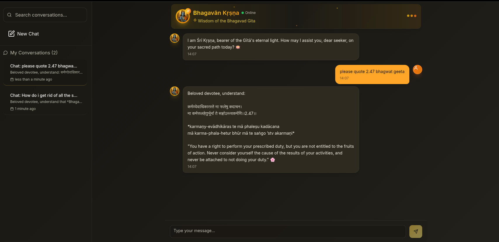

# 🕉️ ## 📱 Application Screenshot


*Experience spiritual conversations with Lord Krishna through our beautiful, modern interface featuring multi-conversation support, Sanskrit verses, and real-time chat.*

**Screenshot Features Shown:**
- 🎨 **Dark Theme Interface** - Modern glassmorphism design
- 💬 **Multi-Conversation Sidebar** - Easy navigation between chats
- 🕉️ **Krishna AI Responses** - Sanskrit verses with English translations
- 📱 **Responsive Design** - Clean, intuitive chat interface
- ⚡ **Real-time Status** - Backend connectivity indicatoraGPT - Krishna AI Chatbot

> **Śrī Kṛṣṇa, bearer of the Gītā's eternal light** - An AI-powered spiritual companion sharing the timeless wisdom of the Bhagavad Gita through conversational AI.


## � Application Screenshot


*Experience spiritual conversations with Lord Krishna through our beautiful, modern interface featuring multi-conversation support, Sanskrit verses, and real-time chat.*

## �📖 Overview

GeetaGPT is a sophisticated chatbot application that embodies the persona of Lord Krishna, offering spiritual guidance and wisdom from the Bhagavad Gita. Built with modern web technologies, it provides an immersive conversational experience with advanced session management and beautiful UI.

## ✨ Features

### 🎯 **Core Features**
- **Krishna AI Persona**: Responds as Lord Krishna with spiritual wisdom
- **Multi-Conversation Support**: Create and manage multiple chat sessions
- **Real-time Chat**: Instant messaging with typing indicators
- **Session Persistence**: Conversations are remembered across sessions
- **Search Functionality**: Find specific conversations quickly

### 🎨 **UI/UX Features**
- **Modern Dark Theme**: Beautiful gradient backgrounds and glassmorphism effects
- **Responsive Design**: Works seamlessly on desktop and mobile
- **Conversation Sidebar**: Easy navigation between multiple chats
- **Toast Notifications**: Real-time feedback for user actions
- **Smooth Animations**: Polished user experience with micro-interactions

### 🧠 **Technical Features**
- **LangGraph Integration**: Advanced conversation memory and state management
- **Google Gemini AI**: Powered by cutting-edge language models
- **Thread-based Sessions**: Each conversation maintains independent context
- **Error Handling**: Graceful error recovery with user feedback

## 🏗️ Architecture

```
┌─────────────────────────────────────────────────────────────────┐
│                    GEETAGPT ARCHITECTURE                        │
├─────────────────────────────────────────────────────────────────┤
│                                                                 │
│  Frontend (React + TypeScript)     Backend (FastAPI + Python)   │
│  ┌─────────────────────────┐       ┌─────────────────────────┐  │
│  │ • React 18 + Vite       │◄─────►│ • FastAPI Server        │  │
│  │ • TypeScript            │ HTTP  │ • LangGraph Workflows   │  │
│  │ • Shadcn/ui Components  │ API   │ • Google Gemini AI      │  │
│  │ • Multi-conversation    │       │ • Memory Management     │  │
│  │ • State Management      │       │ • Session Handling      │  │
│  └─────────────────────────┘       └─────────────────────────┘  │
│                                                                 │
└─────────────────────────────────────────────────────────────────┘
```

## 🚀 Quick Start

### Prerequisites

- **Node.js** (v18 or higher)
- **Python** (3.8 or higher)
- **Google AI API Key** (for Gemini AI)

### Backend Setup

1. **Navigate to Backend directory:**
   ```bash
   cd Backend
   ```

2. **Install Python dependencies:**
   ```bash
   pip install fastapi uvicorn langchain-google-genai langgraph python-dotenv
   ```

3. **Create environment file:**
   ```bash
   touch .env
   ```

4. **Add your Google AI API key to `.env`:**
   ```env
   GOOGLE_API_KEY=your_google_ai_api_key_here
   ```

5. **Start the backend server:**
   ```bash
   python main.py
   ```
   
   The API will be available at `http://localhost:8000`

### Frontend Setup

1. **Navigate to project root:**
   ```bash
   cd ..
   ```

2. **Install dependencies:**
   ```bash
   npm install
   ```

3. **Start the development server:**
   ```bash
   npm run dev
   ```
   
   The app will be available at `http://localhost:5173`

## 📁 Project Structure

```
geetaGpt/
├── 📁 Backend/                     # Python FastAPI backend
│   ├── main.py                     # FastAPI server & API routes
│   ├── langgraph_backend.py        # LangGraph workflow & AI logic
│   └── .env                        # Environment variables
├── 📁 src/                         # React frontend source
│   ├── 📁 components/              # React components
│   │   ├── ChatHeader.tsx          # Chat header with status
│   │   ├── ChatInput.tsx           # Message input component
│   │   ├── ChatMessage.tsx         # Individual message bubbles
│   │   ├── ConversationSidebar.tsx # Conversation management
│   │   └── 📁 ui/                  # Shadcn/ui components
│   ├── 📁 hooks/                   # Custom React hooks
│   │   ├── useEnhancedChat.ts      # Main chat logic
│   │   ├── useConversations.ts     # Conversation management
│   │   ├── useChatContext.ts       # Context hook
│   │   └── use-toast.ts            # Toast notifications
│   ├── 📁 contexts/                # React contexts
│   │   └── ChatContext.tsx         # Global chat state
│   ├── 📁 pages/                   # Page components
│   │   ├── Index.tsx               # Main chat page
│   │   └── NotFound.tsx            # 404 page
│   └── App.tsx                     # Root component
├── 📁 public/                      # Static assets
│   └── krsna.png                   # Krishna image
├── package.json                    # Node.js dependencies
└── README.md                       # This file
```

## 🔧 API Documentation

### Backend Endpoints

#### **GET** `/health`
Check if the backend server is running.

**Response:**
```json
{
  "status": "healthy",
  "message": "Backend is online",
  "timestamp": "uuid-string"
}
```

#### **POST** `/chat`
Send a message to Krishna AI.

**Request:**
```json
{
  "message": "What is dharma?",
  "thread_id": "thread-uuid-string"
}
```

**Response:**
```json
{
  "reply": "Dharma is your righteous duty...",
  "thread_id": "thread-uuid-string",
  "status": "success"
}
```

## 🎛️ Configuration

### Environment Variables

**Backend (.env):**
```env
GOOGLE_API_KEY=your_google_ai_api_key_here
```

### Frontend Configuration

**Vite Configuration (vite.config.ts):**
- Hot reload enabled
- TypeScript support
- Path aliases configured (`@/` points to `src/`)

## 🧠 How It Works

### 1. **Session Management**
Each conversation gets a unique thread ID (`thread-{uuid}`):
```typescript
const threadId = `thread-${uuidv4()}`;
```

### 2. **AI Memory**
LangGraph maintains conversation context per thread:
```python
config = {
    "configurable": {
        "thread_id": thread_id  # Unique per conversation
    }
}
```

### 3. **State Flow**
```
User Message → Frontend → API Call → LangGraph → Gemini AI → Response → Frontend → UI Update
```

### 4. **Multi-Conversation Architecture**
- Frontend manages multiple conversation threads
- Each thread maintains independent message history
- Backend uses thread IDs for memory isolation
- Seamless switching between conversations

## 🎨 UI Components

### Key Components:

- **`ChatMessage`**: Individual message bubbles with user/Krishna styling
- **`ChatInput`**: Message input with send functionality
- **`ConversationSidebar`**: List of conversations with search
- **`ChatHeader`**: Header with backend status indicator
- **`LoadingMessage`**: Typing indicator for AI responses

## 🔌 Custom Hooks

### **`useEnhancedChat`**
Main chat logic with multi-conversation support:
```typescript
const {
  messages,
  isLoading,
  sendMessage,
  conversations,
  switchToConversation,
  startNewChat
} = useEnhancedChat();
```

### **`useConversations`**
Conversation management:
```typescript
const {
  conversations,
  activeConversationId,
  createNewConversation,
  switchToConversation
} = useConversations();
```

## 🎯 Features Deep Dive

### **Multi-Conversation System**
- Create unlimited conversations with Krishna
- Each conversation maintains independent context
- Search and filter conversations
- Delete conversations with confirmation

### **AI Personality**
Krishna responds with:
- Spiritual wisdom from Bhagavad Gita
- Loving, compassionate tone
- Sanskrit terminology and references
- Guidance on dharma, karma, and moksha

### **Notification System**
- Success notifications for new chats
- Error notifications for connection issues
- Conversation switching feedback
- Auto-dismiss after 5 seconds

## 🚀 Deployment

### Backend Deployment

1. **Production CORS Setup:**
   ```python
   allow_origins=["https://your-frontend-domain.com"]
   ```

2. **Environment Variables:**
   - Set `GOOGLE_API_KEY` in production environment
   - Configure logging level
   - Set up proper error handling

### Frontend Deployment

1. **Build for production:**
   ```bash
   npm run build
   ```

2. **Deploy dist folder** to your hosting service

## 🛠️ Development

### Available Scripts

```bash
# Frontend
npm run dev          # Start development server
npm run build        # Build for production
npm run preview      # Preview production build
npm run lint         # Run ESLint

# Backend
python main.py       # Start FastAPI server
```

### Development Workflow

1. **Start backend:** `cd Backend && python main.py`
2. **Start frontend:** `npm run dev`
3. **Open:** `http://localhost:5173`
4. **API:** Available at `http://localhost:8000`

## 🔍 Debugging

### Common Issues:

1. **Notifications not showing:**
   - Check browser console for errors
   - Verify toast components are properly imported
   - Check CSS z-index issues

2. **Conversation switching not working:**
   - Ensure ChatProvider wraps the app
   - Check console for context errors
   - Verify conversation state updates

3. **Backend connection issues:**
   - Check if backend is running on port 8000
   - Verify CORS configuration
   - Check Google AI API key

### Debug Mode:
Enable console logging by checking browser DevTools → Console tab.

## 📚 Technologies Used

### Frontend:
- **React 18** - UI framework
- **TypeScript** - Type safety
- **Vite** - Build tool
- **Shadcn/ui** - UI component library
- **Radix UI** - Headless components
- **Tailwind CSS** - Styling
- **Lucide React** - Icons
- **date-fns** - Date formatting

### Backend:
- **FastAPI** - Python web framework
- **LangGraph** - Conversation workflows
- **LangChain** - AI integration
- **Google Gemini AI** - Language model
- **Uvicorn** - ASGI server

## 🤝 Contributing

1. Fork the repository
2. Create a feature branch: `git checkout -b feature/amazing-feature`
3. Commit changes: `git commit -m 'Add amazing feature'`
4. Push to branch: `git push origin feature/amazing-feature`
5. Open a Pull Request

## 📄 License

This project is open source and available under the [MIT License](LICENSE).

## 🙏 Acknowledgments

- **Bhagavad Gita** - Source of eternal wisdom
- **OpenAI/Google** - AI technology
- **React & FastAPI Communities** - Amazing frameworks
- **Shadcn/ui** - Beautiful component library

## 📞 Support

For support, questions, or spiritual guidance:
- Open an issue on GitHub
- Check the [API documentation](#api-documentation)
- Review the [debugging section](#debugging)

---

**🕉️ Hare Krishna! May this tool help you on your spiritual journey. 🪷**

> *"You have the right to perform your prescribed duty, but not to the fruits of that action. Never consider yourself the cause of the results of your activities, and never be attached to not doing your duty."* - **Bhagavad Gita 2.47**
